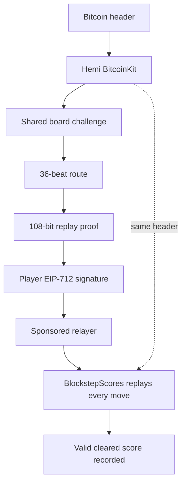

# BLOCKSTEP

**Every step comes back.**

BLOCKSTEP is a desktop pixel arcade game played across 36 beats on a 5 x 5 arena. Every move leaves an echo that strikes four beats later, so the route you create becomes the danger you must survive.

**Bitcoin sets the run. Hemi checks the replay.**

The game is free to play. A wallet is not required to start, finish, score, or create a local replay proof.

## Gameplay

- Survive Beat 36 with at least one of three Lives remaining.
- Choose one move per beat with WASD or the arrow keys.
- Read each four-beat echo and the Bitcoin-derived row or column pulses.
- Collect optional shards and earn close-call bonuses for a higher score.
- Use Hemi Flip once to mirror Pip to the opposite tile, or keep it for the reserve bonus.
- Press `H` for How to Play, `V` after Run Cleared for verification details, `M` to mute, `R` to restart, and `F` for fullscreen.

Cleared runs can have different scores. Hits, shards, close calls, and Hemi Flip usage all affect the result.

## How Hemi powers BLOCKSTEP

A Bitcoin header supplies a shared challenge. Its height and hash deterministically select board pulses, charged echoes, and shard positions. The same header always produces the same board events.

The browser packs all 36 moves into a canonical 108-bit replay proof. The deployed `BlockstepScores` contract independently reads the selected Bitcoin header through Hemi BitcoinKit, reconstructs the challenge, replays every move, and computes the result itself. The browser's displayed score is never accepted as contract input.



### Trust boundaries

| Layer | Responsibility | Trusted for the final score? |
|---|---|---|
| Browser | Renders the game, accepts input, previews the score, and packs the 36 moves | **No** — its displayed score is never submitted |
| Hemi BitcoinKit | Makes the selected Bitcoin header available to the verifier | **Yes, as the shared Bitcoin data source** |
| Player wallet | Authorizes one exact replay with an EIP-712 signature | **Identity only** — it does not choose the score |
| Sponsored relayer | Pays gas and forwards one fixed `submitRunFor` request | **No** — it cannot change the signed route or contract logic |
| `BlockstepScores` | Reads BitcoinKit, rebuilds all hazards and collectibles, replays the route, computes the score, and records valid clears | **Yes** |

### Onchain safeguards

- **No score parameter:** the contract derives survival, hits, shards, close calls, Hemi Flip usage, and the final score from the replay.
- **Canonical proofs only:** bits outside the 108-bit move encoding are rejected, preventing alternate encodings of the same route.
- **Recent-block write window:** score-changing submissions accept only the latest six Bitcoin heights; historical verification remains read-only.
- **Player-bound authorization:** sponsored submissions recover the EIP-712 signer for this chain and this deployed contract.
- **Replay protection:** the same player, Bitcoin height, and route cannot be recorded twice.
- **No admin escape hatch:** the deployed verifier exposes no owner, upgrade, withdrawal, payable-value, or arbitrary-call function.

### Mainnet evidence

- Hemi Mainnet chain ID: `43111`
- BitcoinKit: `0x7007dd1C09527B92AEcd8Ae6570B73d09E0B8F12`
- BlockstepScores: [`0x302449c0dcC71c6ef04820D6c55Cc316fAF15457`](https://explorer.hemi.xyz/address/0x302449c0dcC71c6ef04820D6c55Cc316fAF15457?tab=contract)
- Deployment transaction: [`0x10ec0089cf4acdc8f9813c41a1f6e97afeef4d52544f2148b08d57b12a64b1ab`](https://explorer.hemi.xyz/tx/0x10ec0089cf4acdc8f9813c41a1f6e97afeef4d52544f2148b08d57b12a64b1ab)

The deployed source is verified by Hemi Explorer as an exact match to the repository contract.

### Current network status

Hemi has confirmed a BitcoinKit precompile issue affecting `getHeaderN`. BLOCKSTEP therefore keeps live score submission visibly offline and fails closed: the game remains fully playable, the completed route still produces a local replay proof, and no unverifiable score is written. After Hemi's network upgrade, the same deployed contract can be rechecked and enabled without redeployment.

## Optional score verification

When the Hemi header lookup is available:

1. The verification service supplies a recent confirmed Bitcoin challenge.
2. After Run Cleared, the player's wallet signs an EIP-712 replay message for free.
3. A dedicated low-balance relayer submits one fixed `submitRunFor` transaction and pays the network fee.
4. The contract verifies the signer, replays the route, emits `RunVerified`, and updates the player's best score.

The service accepts only `/api/challenge` and `/api/verify`. It rejects caller-selected RPC URLs, contracts, calldata, transaction values, stale heights, malformed proofs, invalid signatures, and requests above its rate, gas, fee, or balance limits. Removing the server-side relayer credential disables writes without disabling the game.

## Audio and visuals

BLOCKSTEP uses a native 1680 x 945 Canvas 2D renderer with nearest-neighbor pixel scaling. Its board, 25 cell-specific tile sets, Pip rig, HUD tokens, effects, and bitmap font are shipped as nine runtime files under `public/assets`.

Timing-critical sound is generated with Web Audio: countdown, committed steps, returning echoes, Bitcoin pulses, shards, impacts, Hemi Flip, clear, and defeat. There is no background music and no external audio-generation service is used in this version.

## Local development

Requirements: Node.js 20 or newer and a modern desktop browser.

```powershell
npm ci
npm run dev
```

Open `http://127.0.0.1:5173/`. Use `http://127.0.0.1:5173/?offline=1` for deterministic Offline Practice without a network request.

Production build:

```powershell
npm run build
npm run preview
```

## Tests

```powershell
npm test
npm run contract:compile
npm run contract:verification
```

For browser checks, run the preview server in one terminal and then:

```powershell
npm run test:browser
npm run test:wallet
```

The browser exposes `window.render_game_to_text()`, `window.advanceTime(ms)`, and `window.__blockstep` for deterministic accessibility and testing.

## Architecture

- `src/` - deterministic game rules, Canvas renderer, Hemi reads, proof signing, and procedural audio
- `public/assets/` - the exact nine runtime pixel-art files
- `contracts/` - immutable Solidity score verifier and local BitcoinKit fixture
- `worker/` - fixed-purpose, Cloudflare-compatible verification service
- `tests/` - game, proof, relayer, contract-security, wallet, visual, and performance checks
- `wrangler.jsonc` - one Worker entry that applies security headers to static assets and reserves `/api/*` for relayer logic

The relayer credential belongs only in the hosting provider's encrypted secret store. Never place it in `.env`, a `VITE_*` variable, browser code, logs, or source control.

## License and credits

Code and original BLOCKSTEP assets are available under the MIT License. See [LICENSE](./LICENSE) and [CREDITS.md](./CREDITS.md).
